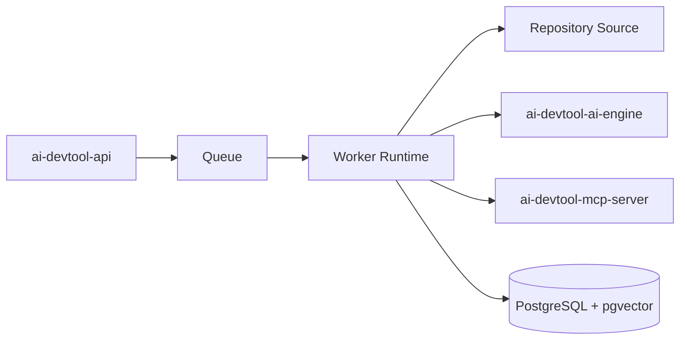
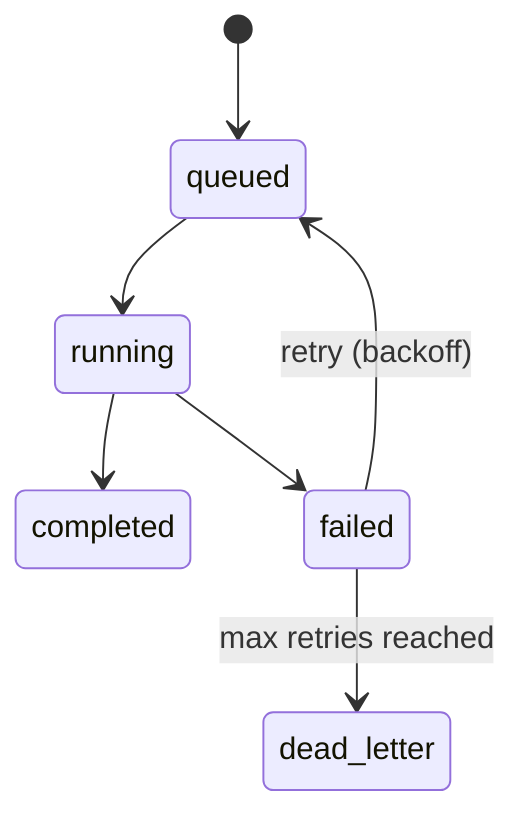

# ai-devtool-worker

Asynchronous worker service for indexing, retrieval preparation, and AI review execution.

## What This Repo Owns
- Queue consumers for indexing and review jobs.
- Long-running workload execution and retry behavior.
- Durable progress updates and result persistence hooks.

## Bounded Context
- Owns async execution semantics.
- Does not own external API boundary (api), tool server contracts (mcp-server), or UI concerns (web).

## System Design Diagram

## Job Lifecycle

## Engineering Standards
- Idempotent handlers for webhook- and job-triggered workloads.
- Exponential backoff and dead-letter handling.
- Structured logs and trace IDs.
- Schema-validated payloads at worker boundaries.

## Repository Layout
- src: processors, job handlers, utilities
- tests: worker/unit smoke tests
- .github/workflows: PR checks and deploy templates

## Local Development
1. npm install
2. npm run typecheck
3. npm run test
4. npm run lint

## Definition of Done for Worker Changes
- Retry and failure semantics validated.
- Idempotency preserved.
- Metrics/log coverage for new job types included.
